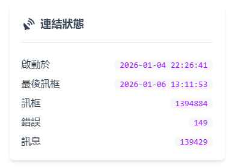
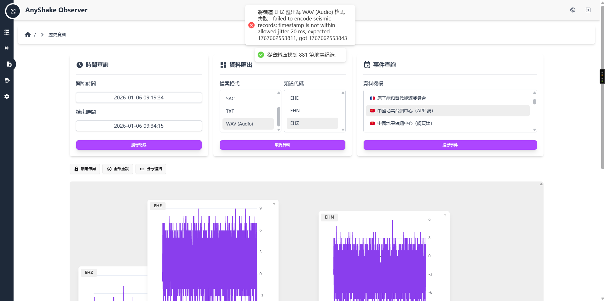
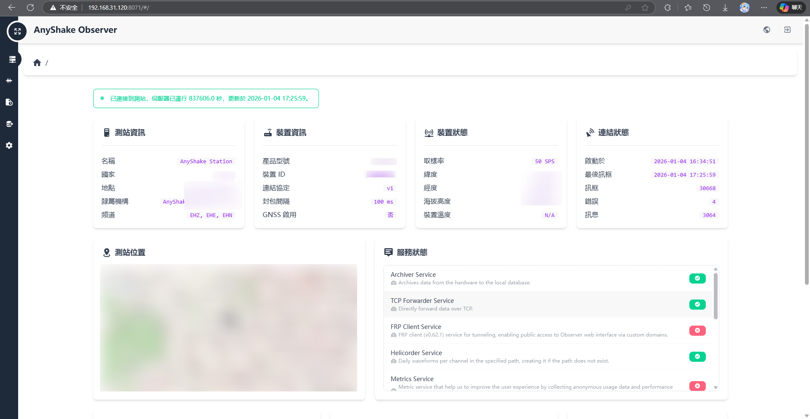
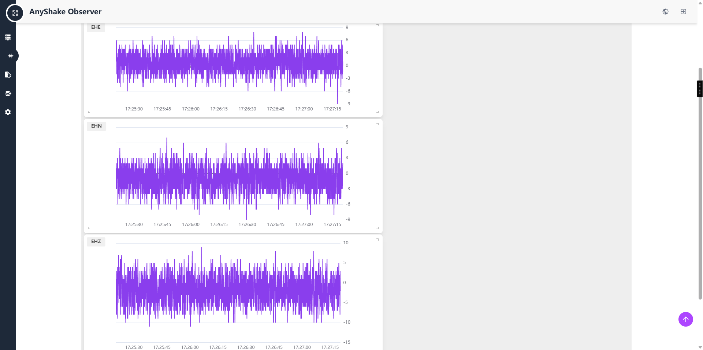

# explorer-esp

> ⚠️ **注意：本仓库代码仅供参考与学习**


> 🤖 **代码与自述文件均有AI辅助编写**

## 简介

这是一个 **AnyShake Explorer 的 ESP32 第三方实现方案**。
通过 **ESP32 + MPU6050** 采集加速度数据，并上传至 **AnyShake Observer**。

该方案具有以下特点：

* 💰 **成本极低**
* 📦 **体积小、占用空间少**
* 🔧 结构简单，便于 DIY 与学习

整体流程如下：

> **采集原始数据→ 校准（仅在初始化过程与静止时校准Z轴） → 滤波 → 上传**

需要注意的是：

* 采集数据**无法与专业测站相比**
* **未经过真实地震环境测试**
* 数据的准确性与可靠性 **无法保证**
* **仅供学习与研究参考**

## 数据协议说明

本方案基于 AnyShake 官方文档中的
[`protocol-v1-legacy`](https://anyshake.org/docs/anyshake-explorer/Data%20Protocol/protocol-v1-legacy) 实现。

已知问题：

* 在数据上传过程中 **可能存在少量 Bug**
* 实际长时间运行测试中，**会出现 很多 次 XOR 校验错误（截图P1）**
* 但是不影响基本使用（但是历史资料->数据导出会出问，题截图P2，但MiniSEED可以正常导出），但仍存在改进空间

P1:



P2:



👉 如果你对该协议或代码优化感兴趣，**非常欢迎提交 PR 或参与修复**！


## 硬件连接

### 所需硬件

* ESP32
* MPU6050
* 杜邦线 / 面包板（推荐）

### 连接方式

请按照下图方式连接 ESP32 与 MPU6050：


建议：

* 使用 **面包板** 可减小整体体积并方便固定
* 由于代码中包含 **位置校准逻辑**，传感器可自由放置于：

  * 墙面
  * 地板
  * 天花板等位置

## 烧录与使用

### 代码修改

配置参数里的采样率可以改，但是不建议改

里面有些未启用的功能：
> ⚠️ **注意：此功能未经测试，请谨慎使用！！！**
1. 温度补偿功能
代码中定义了温度补偿参数并计算了温度变化，但实际上没有应用这些补偿：
- 定义了温度补偿系数但全部设为0
  ```cpp
  #define TEMP_COEFF_X 0.0f
  #define TEMP_COEFF_Y 0.0f
  #define TEMP_COEFF_Z 0.0f
  ```
- 计算了温度差但未使用
  ```cpp
  float temp_diff = current_temp - calib_temp;  // 温度变化量 (未实际使用)
  ```
- 代码注释标注"温度补偿系数 (X轴，当前固定为0)"


### 固件烧录

* `Releases` 中提供 **已编译好的固件（`.bin` 格式）**
* 使用常见 ESP32 烧录工具直接刷入即可

### 设备部署

1. 将 ESP32 固定在 **干扰尽可能小的位置**
2. 使用 USB 数据线连接至：

   * 电脑
   * 服务器
   * 树莓派等 ARM 设备

## Observer 安装与配置

### 下载 Observer

Observer 官方仓库：

* 👉 [AnyShake Observer GitHub](https://github.com/anyshake/observer)

在 `Releases` 中：

* 根据 **上位机架构** 下载对应的 `zip` 文件

安装教程可参考官方文档：

* 📘 [AnyShake Observer 安装指南](https://anyshake.org/docs/anyshake-observer/installing-observer)

### 配置 Observer

1. 解压 Observer 文件
2. 将 `assets/config.json` 移动到 **Observer 程序所在目录**
3. 打开该目录下的 `config.json` 进行配置

推荐使用官方配置工具：

* 🛠️ [AnyShake Prisma](https://anyshake.github.io/prisma/)

#### 关键配置项说明

* **Data Protocol**

  * 必须选择：`v1`（用于兼容本方案的数据格式）

* **Serial Port**

  * Windows：`COM{端口号}`
  * Linux：`/dev/ttyUSB0`
  * ⚠️ 只填写 `//` 后的部分即可，无需删除前缀

* **Database**

  * 可选择：`SQLite`
  * 示例路径：

    ```json
    "./data.db"
    ```
  * Observer 会自动创建数据库文件

### 启动

确认：

* ESP32 正常连接
* Observer 配置正确

启动 Observer 后即可开始采集数据：




## 常见问题

### Linux 无法启动 Observer

请检查文件是否具有执行权限：

```bash
chmod +x observer
```
